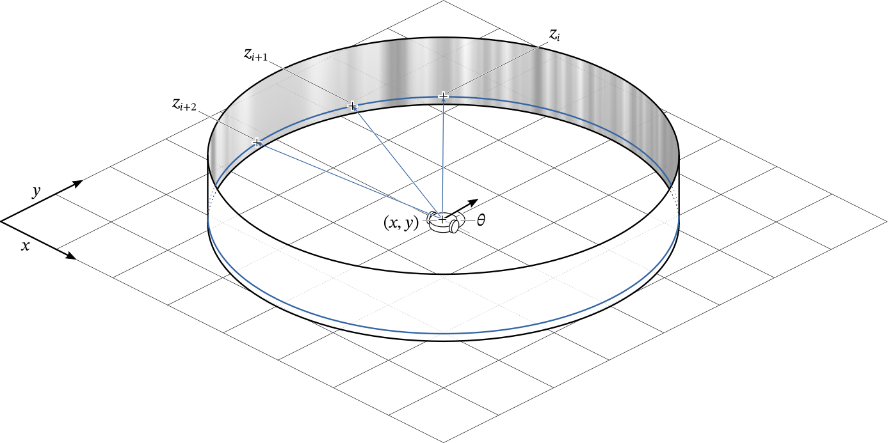

# Cylinder World Renderer



Renders one-dimensional panoramic images in a toy "cylinder world".
An agent is located on the plane in an environment consisting of a randomly
textured cylinder.
The agent measures the light intensity of its surroundings in a 360° range,
resulting in a one-dimensional panoramic image.

This code is mostly meant to generate toy-datasets for machine learning
experiments.

## Features

* **Analytic anti-aliasing**  
  The random cylinder texture is automatically filtered to avoid aliasing
  artefacts.
* **Analytic gradient**  
  Can compute the image-space gradient. This is useful when testing optical
  flow algorithms.
* **Depth**  
  Can compute a ground-truth depth-map.

## How to use

```py
import numpy as np
from cylinder_world import CylinderWorld

world = CylinderWorld(
	resolution=256,    # Number of pixels to render
	n_coeffs=32,       # Number of Fourier coefficients for the texture
	radius=2,          # Radius of the cylinder
	rng=np.random)

# Render the view at location (0.5, -0.4) with orientation np.pi / 2.
# Note all points must be located within the cylinder. The x-, y-, and theta-
# coordinates can be an array to render the view at multiple locations.
world.render(0.5, -0.4, np.pi / 2)
```

## Installation and Testing

This package depends on `numpy`. Simply install this package using `pip`.
```sh
git clone https://github.com/astoeckel/cylinder_world
cd cylinder_world
pip install -e .
```

For unit-tests, install `pytest` and simply run `pytest` from the repository
root directory.

## License
Cylinder World Renderer  
Copyright (C) 2021  Andreas Stöckel

This program is free software: you can redistribute it and/or modify
it under the terms of the GNU General Public License as published by
the Free Software Foundation, either version 3 of the License, or
(at your option) any later version.

This program is distributed in the hope that it will be useful,
but WITHOUT ANY WARRANTY; without even the implied warranty of
MERCHANTABILITY or FITNESS FOR A PARTICULAR PURPOSE.  See the
GNU General Public License for more details.

You should have received a copy of the GNU General Public License
along with this program.  If not, see <https://www.gnu.org/licenses/>.

